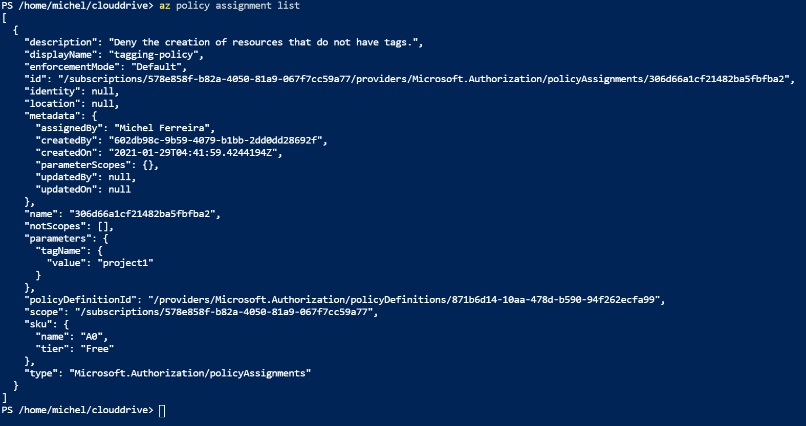
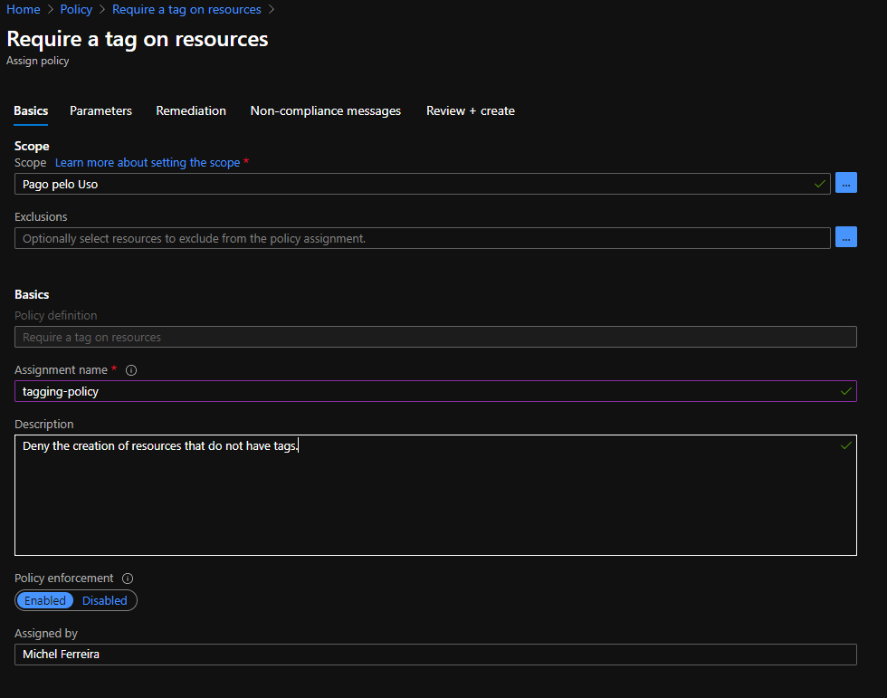

# Azure Infrastructure Operations Project: Deploying a scalable IaaS web server in Azure

# Azure Infrastructure Operations Project: Deploying a scalable IaaS web server in Azure

### Introduction

This is the first project of the Azure DevOps nanodegree, where students must deploy a web server in Azure using terraform and packer.

### First Steps
1. Firstly, we need an [Azure Account](https://portal.azure.com) 
2. After getting an Azure account, we must install the [Azure command-line interface](https://docs.microsoft.com/en-us/cli/azure/install-azure-cli?view=azure-cli-latest)
3. To create and deploy the Virtual Machine (VM) image, we need [Packer](https://www.packer.io/downloads)
4. For automated creation of our infrastructure, we need to install [Terraform](https://www.terraform.io/downloads.html)

### Policy Deployment

Before deploying the infrastructure needed for this project, we must create a policy that ensures all indexed resources are tagged. This policy will help us with organization and tracking, making it easier to log when things go wrong. For this task, we should use the Azure Policy tool found inside the security center. According to the given specifications, the policy to be created should **deny** the creation of resources that **do not have tags**.  

There are many ways to accomplish this task, such as using the Azure Portal to create the policy, Azure Command Line (CLI), or using Terraform. I have decided to check in Azure Policy a policy called **Require a tag on resource** that satisfies our requirements. Below, you can check the policy and pictures of the applied rules. 

~~~
{
  "properties": {
    "displayName": "Require a tag on resources",
    "policyType": "BuiltIn",
    "mode": "Indexed",
    "description": "Enforces existence of a tag. Does not apply to resource groups.",
    "metadata": {
      "version": "1.0.1",
      "category": "Tags"
    },
    "parameters": {
      "tagName": {
        "type": "String",
        "metadata": {
          "displayName": "Tag Name",
          "description": "Name of the tag, such as 'environment'"
        }
      }
    },
    "policyRule": {
      "if": {
        "field": "[concat('tags[', parameters('tagName'), ']')]",
        "exists": "false"
      },
      "then": {
        "effect": "deny"
      }
    }
  },
  "id": "/providers/Microsoft.Authorization/policyDefinitions/871b6d14-10aa-478d-b590-94f262ecfa99",
  "type": "Microsoft.Authorization/policyDefinitions",
  "name": "871b6d14-10aa-478d-b590-94f262ecfa99"
}
~~~

### Packer Template

In order to support application deployment, we need to create an image that different organizations can take advantage of to deploy their own apps.To do this, we need to create a packer image that anyone can use, and we will leverage in our own Terraform template. To do so, we use packer to create a server image, ensuring that the provided application is included in the template. In order to complete the requiments of this project, the template uses environment variables to create the nedded vm image.

* Use an Ubuntu 18.04-LTS SKY as base image
* Ensure the following commands execute:

~~~
"inline": ["echo 'Hello, World!' > index.html", "nohup busybox httpd -f -p 80 &" ], "inline_shebang" : "/bin/sh -x", "type" : "shell"
~~~

* Ensure that the resource group specified in packer for the image is the same image specified in Terraform

### How to Run ?

It is easy: just use the script *run.ps1* on AZURE CLI, and all the IAC steps will execute. This is how this script works:

* First, an Application is registered in azure to execute the IAC 
* After the registration of the app, the variables (client_id, tenant_id, subscription_id, and client_secret) are stored on the user's environment
* Packer is executed, using the env variables to fill the values inside json and it creates the vm image
* After that, Terraform is executed to create the other resources needed for this project
